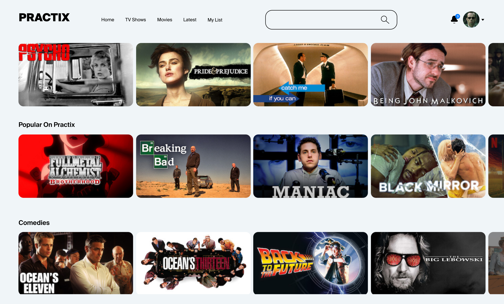
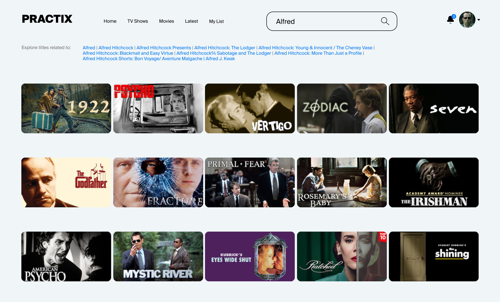
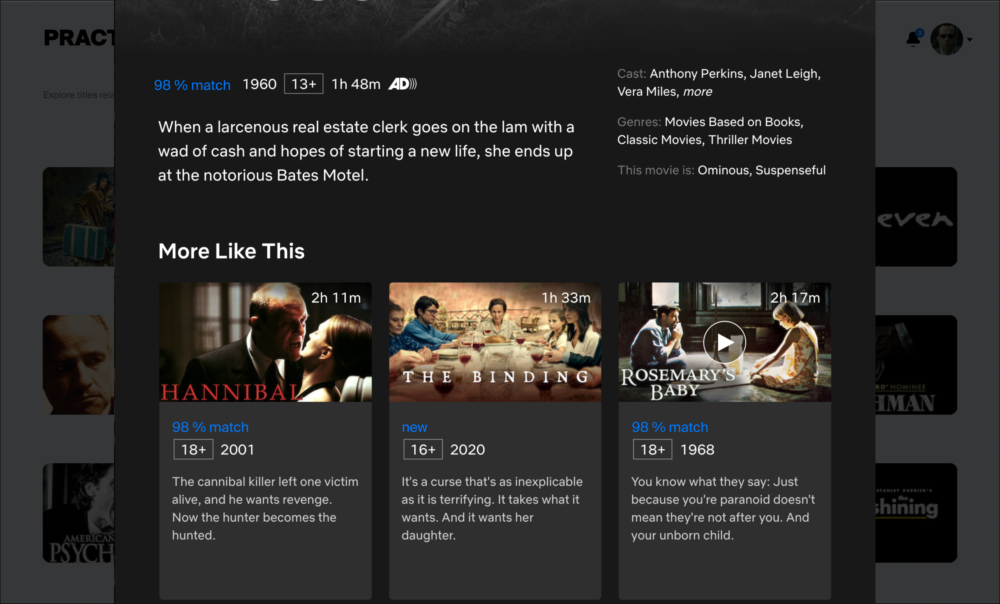
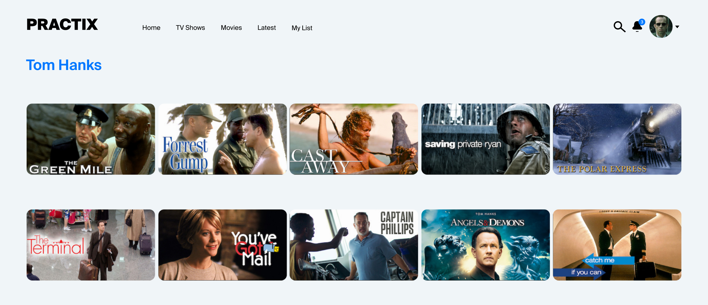
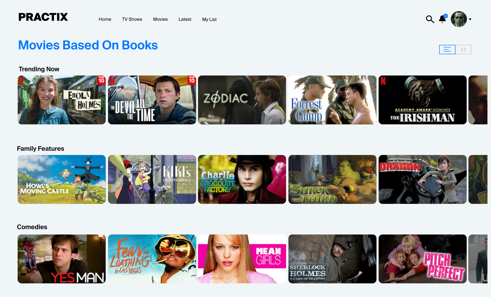

# Техническое задание

[Назад](../README.md)

## Используемые технологии
* Код приложения пишется на Python + FastAPI.
* Приложение запускается под управлением сервера ASGI(uvicorn).
* В качестве хранилища используется ElasticSearch.
* Для кеширования данных понадобится Redis Cluster.
* Все компоненты системы запускаются через Docker.

## Основные сущности
* Фильм — заголовок, содержание, дата создания, режиссёры, актёры, сценаристы, жанры, ссылка на файл.
* Актёр — имя, фамилия, фильмы с его участием.
* Режиссёр — имя, фамилия, фильмы, которые он снял.
* Сценарист — имя, фамилия, фильмы по его сценариям.
* Жанр — описание.

## Экраны в клиентском приложении

### 1. Главная страница

### 2. Поиск

### 3. Страница фильма

### 4. Страница персонажа

### 5. Страница жанра

## Требования к проекту

1. Структура API должна быть понятна пользователям и задокументирована.
2. Код проекта должен быть аккуратным и без дублирования.
3. Время ответа сервиса не превышает 200 мс.
4. В сервисе решена проблема 10к соединений.

## Требования к объёму данных

* 200 000+ фильмов.
* 100+ жанров.

[Назад](../README.md)